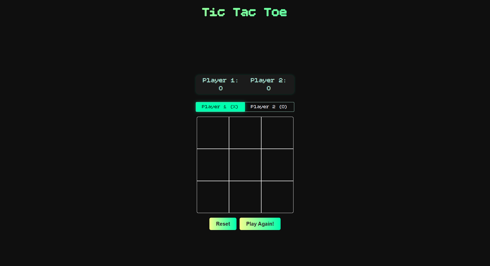

````{"variant":"standard","title":"README for Tic Tac Toe Game","id":"59201"}
# 🎮 Tic Tac Toe — A Classic Game Reimagined

A modern, responsive, and interactive version of the classic **Tic Tac Toe** game — built using **HTML**, **CSS**, and **JavaScript** only.

---

## ✨ Features

✅ **Two-player gameplay** — play locally with friends  
✅ **Responsive design** — fully optimized for mobile & desktop  
✅ **Dynamic scoreboard** — tracks each player’s total wins  
✅ **Smooth transitions** — with animation and subtle UI effects  
✅ **Restart & Reset options** — continue rounds or start fresh  
✅ **No frameworks** — built purely with vanilla web tech

---

## 🧩 Tech Stack

| Technology | Purpose |
|-------------|----------|
| **HTML5** | Structure & layout |
| **CSS3 (Flexbox + Grid)** | Styling & responsiveness |
| **JavaScript (ES6)** | Game logic & interactivity |

---

## 🚀 Live Demo

👉 [**Play the Game Here**](#)  

---

## 🕹️ How to Play

1. Enter both player names on the home screen.  
2. Click **Start Game**.  
3. Take turns placing X and O on the grid.  
4. First to align 3 marks (vertically, horizontally, or diagonally) wins!  
5. Use **Reset** to play again or **Restart** to start over completely.

---

## 🧠 Game Logic Highlights

- The game board is stored as a **9-element array**.  
- Winning combinations are checked after each move.  
- Player switching handled by a **toggle-based state system**.  
- The scoreboard dynamically updates after each win.

Example snippet:
```js
const lines = [
  [0, 1, 2],
  [3, 4, 5],
  [6, 7, 8],
  [0, 3, 6],
  [1, 4, 7],
  [2, 5, 8],
  [0, 4, 8],
  [2, 4, 6],
];
```

---

## 💅 Visual Theme

- Background: `#2a2a2a` (dark minimal base)  
- Primary accent: `#00ffae` (vibrant mint green)  
- Highlight: `#f4ff8f` (soft yellow)  
- Font: *Bitcount Grid Single* + *Ubuntu*  

---

## 📸 Preview

*(You can drag screenshots into your README here)*  


---

## ⚡ Setup & Run Locally

```bash
# Clone the repository
git clone https://github.com/Tusharmgs/tic-tac-toe.git

# Go into the project folder
cd tic-tac-toe

# Open with Live Server (VS Code extension)
```

Or simply double-click `index.html` to open in your browser.

---

## 🔮 Future Enhancements

- [ ] Add **Single Player (AI mode)** 🤖  
- [ ] Add **Dark / Light Mode Toggle** 🌗  
- [ ] Add **Confetti Animation** for winners 🎉  
- [ ] Add **Sound Effects** for moves 🔊  

---

## 🧑‍💻 Author

**Tushar Keshari**  
🎓 BCA, Microtek Collage of Management and Technology  
💡 Passionate about front-end development and interactive design  
📬 [LinkedIn](https://www.linkedin.com/in/hritik-keshari/) • [GitHub](https://github.com/<your-username>)

---

## ⭐ Show Some Love!

If you like this project:
- ⭐ **Star** this repo on GitHub  
- 🪄 **Fork** it to build your own version  
- 💬 Drop feedback — suggestions are welcome!
````


